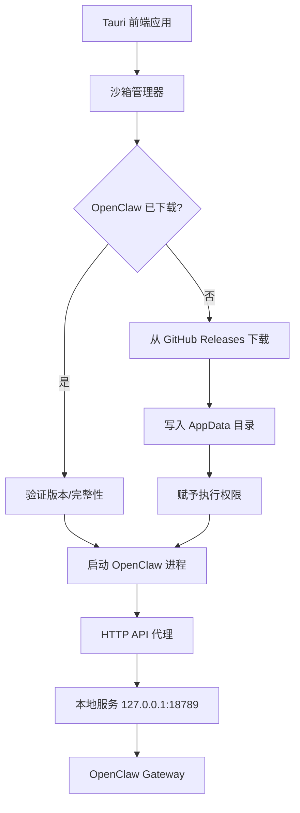

# OpenClaw Tauri 沙箱自动部署方案

## 技术架构概览



---

## 1. 项目结构

```
src-tauri/
├── src/
│   ├── main.rs              # 应用入口
│   ├── lib.rs               # 模块导出
│   ├── sandbox/             # 沙箱核心模块
│   │   ├── mod.rs           # 模块入口
│   │   ├── download.rs      # 下载管理
│   │   ├── verify.rs        # 校验和验证
│   │   ├── process.rs       # 进程管理
│   │   └── update.rs        # 自动更新
│   ├── config/              # 配置管理
│   │   ├── mod.rs
│   │   └── openclaw.rs      # OpenClaw 配置
│   ├── api/                 # HTTP API 封装
│   │   ├── mod.rs
│   │   └── proxy.rs         # 请求代理
│   └── error.rs             # 错误处理
├── Cargo.toml
└── tauri.conf.json
```

---

## 2. 核心模块实现

### 2.1 沙箱管理器 (`src/sandbox/mod.rs`)

```rust
//! OpenClaw 沙箱自动部署管理器
//! 
//! 负责：
//! - 检测当前平台并确定正确的二进制文件
//! - 管理下载、缓存和版本控制
//! - 进程生命周期管理
//! - 自动更新检查

use std::path::PathBuf;
use tauri::{AppHandle, Manager};
use serde::{Serialize, Deserialize};
use tokio::sync::RwLock;
use std::sync::Arc;

pub mod download;
pub mod verify;
pub mod process;
pub mod update;

/// 沙箱状态
#[derive(Debug, Clone, Serialize, Deserialize)]
pub struct SandboxStatus {
    pub installed: bool,
    pub version: Option<String>,
    pub path: Option<PathBuf>,
    pub running: bool,
    pub pid: Option<u32>,
    pub port: u16,
}

/// 沙箱管理器
pub struct SandboxManager {
    app: AppHandle,
    status: Arc<RwLock<SandboxStatus>>,
    process_handle: Arc<RwLock<Option<process::ProcessHandle>>>,
}

impl SandboxManager {
    pub fn new(app: AppHandle) -> Self {
        let status = SandboxStatus {
            installed: false,
            version: None,
            path: None,
            running: false,
            pid: None,
            port: 18789,
        };

        Self {
            app,
            status: Arc::new(RwLock::new(status)),
            process_handle: Arc::new(RwLock::new(None)),
        }
    }

    /// 初始化沙箱：检查或下载 OpenClaw
    pub async fn initialize(&self) -> Result<SandboxStatus, SandboxError> {
        let mut status = self.status.write().await;

        // 检查是否已安装
        let bin_path = self.get_binary_path().await;

        if bin_path.exists() {
            // 验证现有安装
            let version = verify::get_version(&bin_path).await?;
            status.installed = true;
            status.version = Some(version);
            status.path = Some(bin_path);
        } else {
            // 需要下载
            drop(status); // 释放锁，避免下载时死锁
            self.download_and_install().await?;

            // 重新获取状态
            let mut status = self.status.write().await;
            let bin_path = self.get_binary_path().await;
            status.installed = true;
            status.version = verify::get_version(&bin_path).await.ok();
            status.path = Some(bin_path);
        }

        Ok(status.clone())
    }

    /// 启动 OpenClaw 服务
    pub async fn start(&self, config: LaunchConfig) -> Result<SandboxStatus, SandboxError> {
        let bin_path = self.get_binary_path().await;

        if !bin_path.exists() {
            return Err(SandboxError::NotInstalled);
        }

        // 检查是否已在运行
        let status = self.status.read().await;
        if status.running {
            return Ok(status.clone());
        }
        drop(status);

        // 准备配置
        let config_path = self.prepare_config(&config).await?;

        // 启动进程
        let handle = process::spawn(
            &bin_path,
            config.port,
            &config_path,
            self.app.clone(),
        ).await?;

        // 等待服务就绪
        self.wait_for_ready(config.port).await?;

        // 更新状态
        let mut status = self.status.write().await;
        status.running = true;
        status.port = config.port;
        status.pid = Some(handle.id());
        drop(status);

        *self.process_handle.write().await = Some(handle);

        Ok(self.status.read().await.clone())
    }

    /// 停止 OpenClaw 服务
    pub async fn stop(&self) -> Result<(), SandboxError> {
        let mut handle = self.process_handle.write().await;
        if let Some(h) = handle.take() {
            h.kill().await?;
        }

        let mut status = self.status.write().await;
        status.running = false;
        status.pid = None;

        Ok(())
    }

    /// 获取当前状态
    pub async fn status(&self) -> SandboxStatus {
        self.status.read().await.clone()
    }

    /// 检查并执行自动更新
    pub async fn check_update(&self) -> Result<Option<String>, SandboxError> {
        let current = self.status.read().await.version.clone();
        let latest = update::fetch_latest_version().await?;

        if current.as_ref() != Some(&latest) {
            // 有新版本
            update::download_version(&latest, &self.get_binary_path().await).await?;

            let mut status = self.status.write().await;
            status.version = Some(latest.clone());

            return Ok(Some(latest));
        }

        Ok(None)
    }

    // 内部辅助方法
    async fn get_binary_path(&self) -> PathBuf {
        let app_dir = self.app.path().app_data_dir().unwrap();
        let bin_dir = app_dir.join("binaries");
        bin_dir.join(get_platform_binary_name())
    }

    async fn download_and_install(&self) -> Result<(), SandboxError> {
        let bin_path = self.get_binary_path().await;
        let temp_path = bin_path.with_extension("tmp");

        // 确保目录存在
        if let Some(parent) = bin_path.parent() {
            tokio::fs::create_dir_all(parent).await?;
        }

        // 下载到临时文件
        download::fetch_binary(&temp_path).await?;

        // 验证下载
        verify::checksum(&temp_path).await?;

        // 赋予执行权限（Unix）
        #[cfg(unix)]
        {
            use std::os::unix::fs::PermissionsExt;
            let mut perms = tokio::fs::metadata(&temp_path).await?.permissions();
            perms.set_mode(0o755);
            tokio::fs::set_permissions(&temp_path, perms).await?;
        }

        // 原子性移动
        tokio::fs::rename(&temp_path, &bin_path).await?;

        Ok(())
    }

    async fn prepare_config(&self, config: &LaunchConfig) -> Result<PathBuf, SandboxError> {
        let app_dir = self.app.path().app_data_dir().unwrap();
        let config_dir = app_dir.join("config");
        tokio::fs::create_dir_all(&config_dir).await?;

        let config_path = config_dir.join("openclaw.json");
        let config_json = serde_json::to_string_pretty(&config.openclaw)?;
        tokio::fs::write(&config_path, config_json).await?;

        Ok(config_path)
    }

    async fn wait_for_ready(&self, port: u16) -> Result<(), SandboxError> {
        let url = format!("http://127.0.0.1:{}/health", port);

        for _ in 0..30 { // 最多等待 30 秒
            match reqwest::get(&url).await {
                Ok(resp) if resp.status().is_success() => return Ok(()),
                _ => tokio::time::sleep(tokio::time::Duration::from_secs(1)).await,
            }
        }

        Err(SandboxError::StartupTimeout)
    }
}

#[derive(Debug, Clone, Deserialize)]
pub struct LaunchConfig {
    pub port: u16,
    pub openclaw: OpenClawConfig,
}

#[derive(Debug, Clone, Serialize, Deserialize)]
pub struct OpenClawConfig {
    pub channels: Option<serde_json::Value>,
    pub messages: Option<serde_json::Value>,
    pub plugins: Option<Vec<String>>,
}

#[derive(Debug, thiserror::Error)]
pub enum SandboxError {
    #[error("OpenClaw 未安装")]
    NotInstalled,
    #[error("下载失败: {0}")]
    DownloadFailed(String),
    #[error("校验失败: {0}")]
    VerificationFailed(String),
    #[error("启动超时")]
    StartupTimeout,
    #[error("进程错误: {0}")]
    ProcessError(String),
    #[error("IO 错误: {0}")]
    Io(#[from] std::io::Error),
    #[error("HTTP 错误: {0}")]
    Http(#[from] reqwest::Error),
    #[error("序列化错误: {0}")]
    Serde(#[from] serde_json::Error),
}

// 平台检测
fn get_platform_binary_name() -> String {
    let target = if cfg!(target_os = "macos") {
        if cfg!(target_arch = "aarch64") {
            "openclaw-aarch64-apple-darwin"
        } else {
            "openclaw-x86_64-apple-darwin"
        }
    } else if cfg!(target_os = "linux") {
        if cfg!(target_arch = "aarch64") {
            "openclaw-aarch64-unknown-linux-gnu"
        } else {
            "openclaw-x86_64-unknown-linux-gnu"
        }
    } else if cfg!(target_os = "windows") {
        "openclaw-x86_64-pc-windows-msvc.exe"
    } else {
        panic!("不支持的平台")
    };
    target.to_string()
}
```

---

### 2.2 下载管理 (`src/sandbox/download.rs`)

```rust
//! OpenClaw 二进制文件下载管理
//! 
//! 支持：
//! - 断点续传
//! - 进度回调
//! - 多镜像源回退
//! - 代理支持

use std::path::Path;
use tokio::io::AsyncWriteExt;
use futures_util::StreamExt;

const GITHUB_RELEASES_URL: &str = "https://github.com/openclaw/openclaw/releases/download";
const MIRROR_URLS: &[&str] = &[
    "https://ghproxy.com/https://github.com/openclaw/openclaw/releases/download",
    "https://mirror.ghproxy.com/https://github.com/openclaw/openclaw/releases/download",
];

pub struct DownloadProgress {
    pub downloaded: u64,
    pub total: Option<u64>,
    pub speed: f64, // bytes/s
}

pub async fn fetch_binary<P: AsRef<Path>>(dest: P) -> Result<(), super::SandboxError> {
    let platform = super::get_platform_binary_name();
    let version = get_latest_version_tag().await?;

    let url = format!("{}/{}/{}", GITHUB_RELEASES_URL, version, platform);

    // 尝试主源和镜像
    let mut last_error = None;
    for base_url in [GITHUB_RELEASES_URL].iter().chain(MIRROR_URLS.iter()) {
        let url = format!("{}/{}/{}", base_url, version, platform);

        match try_download(&url, dest.as_ref()).await {
            Ok(_) => return Ok(()),
            Err(e) => {
                log::warn!("下载失败 {}: {}", url, e);
                last_error = Some(e);
            }
        }
    }

    Err(super::SandboxError::DownloadFailed(
        last_error.map(|e| e.to_string()).unwrap_or_default()
    ))
}

pub async fn fetch_binary_with_progress<P: AsRef<Path>, F>(
    dest: P,
    mut on_progress: F,
) -> Result<(), super::SandboxError>
where
    F: FnMut(DownloadProgress),
{
    let platform = super::get_platform_binary_name();
    let version = get_latest_version_tag().await?;
    let url = format!("{}/{}/{}", GITHUB_RELEASES_URL, version, platform);

    let client = reqwest::Client::builder()
        .timeout(std::time::Duration::from_secs(300))
        .build()?;

    let response = client.get(&url).send().await?;
    let total = response.content_length();

    let mut file = tokio::fs::File::create(dest.as_ref()).await?;
    let mut stream = response.bytes_stream();
    let mut downloaded: u64 = 0;
    let start_time = std::time::Instant::now();

    while let Some(chunk) = stream.next().await {
        let chunk = chunk?;
        file.write_all(&chunk).await?;

        downloaded += chunk.len() as u64;
        let elapsed = start_time.elapsed().as_secs_f64();
        let speed = if elapsed > 0.0 { downloaded as f64 / elapsed } else { 0.0 };

        on_progress(DownloadProgress {
            downloaded,
            total,
            speed,
        });
    }

    file.flush().await?;
    Ok(())
}

async fn try_download(url: &str, dest: &Path) -> Result<(), reqwest::Error> {
    let client = reqwest::Client::builder()
        .timeout(std::time::Duration::from_secs(300))
        .build()?;

    let response = client.get(url).send().await?.error_for_status()?;
    let bytes = response.bytes().await?;

    tokio::fs::write(dest, bytes).await?;
    Ok(())
}

async fn get_latest_version_tag() -> Result<String, reqwest::Error> {
    // 使用 GitHub API 获取最新 release tag
    let client = reqwest::Client::new();
    let response = client
        .get("https://api.github.com/repos/openclaw/openclaw/releases/latest")
        .header("User-Agent", "OpenClaw-Desktop")
        .send()
        .await?
        .json::<serde_json::Value>()
        .await?;

    let tag = response["tag_name"]
        .as_str()
        .ok_or_else(|| reqwest::Error::from(std::io::Error::new(
            std::io::ErrorKind::InvalidData,
            "无法获取版本标签"
        )))?;

    Ok(tag.to_string())
}
```

---

### 2.3 进程管理 (`src/sandbox/process.rs`)

```rust
//! OpenClaw 进程管理
//! 
//! 功能：
//! - 启动/停止/重启
//! - 日志收集
//! - 健康检查
//! - 自动重启

use std::path::Path;
use tauri::AppHandle;
use tokio::process::{Child, Command};
use tokio::sync::mpsc;
use serde::Serialize;

pub struct ProcessHandle {
    child: Child,
    pub id: u32,
    log_tx: mpsc::Sender<LogEntry>,
}

#[derive(Debug, Clone, Serialize)]
pub struct LogEntry {
    pub timestamp: u64,
    pub level: String,
    pub message: String,
}

impl ProcessHandle {
    pub async fn kill(mut self) -> Result<(), super::SandboxError> {
        #[cfg(unix)]
        {
            use nix::sys::signal::{kill, Signal};
            use nix::unistd::Pid;
            kill(Pid::from_raw(self.id as i32), Signal::SIGTERM)
                .map_err(|e| super::SandboxError::ProcessError(e.to_string()))?;
        }
        #[cfg(windows)]
        {
            self.child.kill().await?;
        }

        Ok(())
    }

    pub fn id(&self) -> u32 {
        self.id
    }
}

pub async fn spawn(
    bin_path: &Path,
    port: u16,
    config_path: &Path,
    app: AppHandle,
) -> Result<ProcessHandle, super::SandboxError> {
    let (log_tx, mut log_rx) = mpsc::channel::<LogEntry>(100);

    let mut cmd = Command::new(bin_path);
    cmd.arg("--port").arg(port.to_string())
       .arg("--config").arg(config_path)
       .arg("--headless") // 无头模式，适合作为 sidecar
       .stdout(std::process::Stdio::piped())
       .stderr(std::process::Stdio::piped());

    #[cfg(windows)]
    {
        cmd.creation_flags(0x08000000); // CREATE_NO_WINDOW
    }

    let mut child = cmd.spawn()?;
    let pid = child.id().ok_or_else(|| {
        super::SandboxError::ProcessError("无法获取进程 ID".to_string())
    })?;

    // 启动日志收集任务
    let stdout = child.stdout.take().unwrap();
    let stderr = child.stderr.take().unwrap();
    let log_tx_clone = log_tx.clone();
    let app_clone = app.clone();

    tokio::spawn(async move {
        let reader = tokio::io::BufReader::new(stdout);
        let mut lines = tokio::io::AsyncBufReadExt::lines(reader);

        while let Ok(Some(line)) = lines.next_line().await {
            let entry = LogEntry {
                timestamp: chrono::Utc::now().timestamp_millis() as u64,
                level: "INFO".to_string(),
                message: line,
            };

            // 发送到前端
            let _ = app_clone.emit("openclaw-stdout", &entry);
            let _ = log_tx_clone.send(entry).await;
        }
    });

    let app_clone = app.clone();
    tokio::spawn(async move {
        let reader = tokio::io::BufReader::new(stderr);
        let mut lines = tokio::io::AsyncBufReadExt::lines(reader);

        while let Ok(Some(line)) = lines.next_line().await {
            let entry = LogEntry {
                timestamp: chrono::Utc::now().timestamp_millis() as u64,
                level: "ERROR".to_string(),
                message: line,
            };

            let _ = app_clone.emit("openclaw-stderr", &entry);
            let _ = log_tx.send(entry).await;
        }
    });

    // 进程监控任务
    tokio::spawn(async move {
        let status = child.wait().await;
        let _ = app.emit("openclaw-exited", status.map(|s| s.code()).unwrap_or(None));
    });

    Ok(ProcessHandle {
        child,
        id: pid,
        log_tx,
    })
}
```

---

### 2.4 自动更新 (`src/sandbox/update.rs`)

```rust
//! OpenClaw 自动更新模块

use std::path::Path;
use semver::Version;

pub async fn fetch_latest_version() -> Result<String, super::SandboxError> {
    let client = reqwest::Client::new();
    let response = client
        .get("https://api.github.com/repos/openclaw/openclaw/releases/latest")
        .header("User-Agent", "OpenClaw-Desktop")
        .send()
        .await?
        .json::<serde_json::Value>()
        .await?;

    let tag = response["tag_name"]
        .as_str()
        .ok_or_else(|| super::SandboxError::DownloadFailed("无法解析版本".to_string()))?;

    // 移除 v 前缀
    Ok(tag.trim_start_matches('v').to_string())
}

pub async fn download_version(
    version: &str,
    dest: &Path,
) -> Result<(), super::SandboxError> {
    let platform = super::get_platform_binary_name();
    let url = format!(
        "https://github.com/openclaw/openclaw/releases/download/v{}/{}",
        version, platform
    );

    let temp_path = dest.with_extension("tmp");

    // 下载
    let client = reqwest::Client::new();
    let response = client.get(&url).send().await?.error_for_status()?;
    let bytes = response.bytes().await?;

    tokio::fs::write(&temp_path, bytes).await?;

    // 验证
    super::verify::checksum(&temp_path).await?;

    // 替换
    tokio::fs::rename(&temp_path, dest).await?;

    Ok(())
}

pub fn compare_versions(current: &str, latest: &str) -> bool {
    let current = Version::parse(current).ok();
    let latest = Version::parse(latest).ok();

    match (current, latest) {
        (Some(c), Some(l)) => l > c,
        _ => true, // 无法解析时默认需要更新
    }
}
```

---

### 2.5 Tauri 命令封装 (`src/commands.rs`)

```rust
//! Tauri 命令接口

use tauri::{AppHandle, State};
use crate::sandbox::{SandboxManager, LaunchConfig, OpenClawConfig};

#[tauri::command]
pub async fn initialize_sandbox(
    state: State<'_, SandboxManager>,
) -> Result<serde_json::Value, String> {
    let status = state.initialize().await.map_err(|e| e.to_string())?;
    Ok(serde_json::to_value(status).unwrap())
}

#[tauri::command]
pub async fn start_openclaw(
    state: State<'_, SandboxManager>,
    port: Option<u16>,
    config: Option<OpenClawConfig>,
) -> Result<serde_json::Value, String> {
    let launch_config = LaunchConfig {
        port: port.unwrap_or(18789),
        openclaw: config.unwrap_or_default(),
    };

    let status = state.start(launch_config).await.map_err(|e| e.to_string())?;
    Ok(serde_json::to_value(status).unwrap())
}

#[tauri::command]
pub async fn stop_openclaw(
    state: State<'_, SandboxManager>,
) -> Result<(), String> {
    state.stop().await.map_err(|e| e.to_string())
}

#[tauri::command]
pub async fn get_sandbox_status(
    state: State<'_, SandboxManager>,
) -> Result<serde_json::Value, String> {
    let status = state.status().await;
    Ok(serde_json::to_value(status).unwrap())
}

#[tauri::command]
pub async fn check_for_updates(
    state: State<'_, SandboxManager>,
) -> Result<Option<String>, String> {
    state.check_update().await.map_err(|e| e.to_string())
}

#[tauri::command]
pub async fn open_dashboard(port: u16) -> Result<(), String> {
    let url = format!("http://127.0.0.1:{}", port);
    open::that(&url).map_err(|e| e.to_string())
}
```

---

## 3. 前端集成

### 3.1 TypeScript API 封装 (`src/lib/openclaw.ts`)

```typescript
/**
 * OpenClaw 沙箱管理器
 * 提供完整的生命周期管理和 API 代理
 */

import { invoke } from '@tauri-apps/api/core';
import { listen, Event } from '@tauri-apps/api/event';
import { open } from '@tauri-apps/plugin-shell';

export interface SandboxStatus {
  installed: boolean;
  version: string | null;
  path: string | null;
  running: boolean;
  pid: number | null;
  port: number;
}

export interface OpenClawConfig {
  channels?: {
    whatsapp?: {
      allowFrom?: string[];
      groups?: Record<string, { requireMention: boolean }>;
    };
    telegram?: {
      token?: string;
      allowedUsers?: string[];
    };
  };
  messages?: {
    groupChat?: {
      mentionPatterns?: string[];
    };
  };
  plugins?: string[];
}

export interface LogEntry {
  timestamp: number;
  level: 'INFO' | 'ERROR' | 'WARN';
  message: string;
}

export interface DownloadProgress {
  downloaded: number;
  total: number | null;
  speed: number;
}

export class OpenClawManager {
  private static instance: OpenClawManager;
  private statusListeners: Set<(status: SandboxStatus) => void> = new Set();
  private logListeners: Set<(log: LogEntry) => void> = new Set();
  private unlisteners: (() => void)[] = [];

  private constructor() {
    this.setupEventListeners();
  }

  static getInstance(): OpenClawManager {
    if (!OpenClawManager.instance) {
      OpenClawManager.instance = new OpenClawManager();
    }
    return OpenClawManager.instance;
  }

  /**
   * 初始化沙箱（自动下载/验证 OpenClaw）
   */
  async initialize(): Promise<SandboxStatus> {
    return await invoke('initialize_sandbox');
  }

  /**
   * 启动 OpenClaw 服务
   */
  async start(port?: number, config?: OpenClawConfig): Promise<SandboxStatus> {
    return await invoke('start_openclaw', { port, config });
  }

  /**
   * 停止 OpenClaw 服务
   */
  async stop(): Promise<void> {
    return await invoke('stop_openclaw');
  }

  /**
   * 获取当前状态
   */
  async getStatus(): Promise<SandboxStatus> {
    return await invoke('get_sandbox_status');
  }

  /**
   * 检查更新
   */
  async checkUpdate(): Promise<string | null> {
    return await invoke('check_for_updates');
  }

  /**
   * 打开 OpenClaw 仪表板
   */
  async openDashboard(port: number = 18789): Promise<void> {
    const url = `http://127.0.0.1:${port}`;
    await open(url);
  }

  /**
   * 代理 HTTP 请求到 OpenClaw API
   */
  async apiRequest<T = any>(
    endpoint: string,
    options: RequestInit = {},
    port: number = 18789
  ): Promise<T> {
    const url = `http://127.0.0.1:${port}/api/v1${endpoint}`;
    const response = await fetch(url, {
      headers: {
        'Content-Type': 'application/json',
        ...options.headers,
      },
      ...options,
    });

    if (!response.ok) {
      throw new Error(`API 错误: ${response.status} ${response.statusText}`);
    }

    return response.json();
  }

  /**
   * 发送消息（示例 API 调用）
   */
  async sendMessage(
    channel: string,
    message: string,
    port: number = 18789
  ): Promise<any> {
    return this.apiRequest(
      '/messages',
      {
        method: 'POST',
        body: JSON.stringify({ channel, message }),
      },
      port
    );
  }

  /**
   * 订阅状态变化
   */
  onStatusChange(callback: (status: SandboxStatus) => void): () => void {
    this.statusListeners.add(callback);
    return () => this.statusListeners.delete(callback);
  }

  /**
   * 订阅日志
   */
  onLog(callback: (log: LogEntry) => void): () => void {
    this.logListeners.add(callback);
    return () => this.logListeners.delete(callback);
  }

  /**
   * 清理资源
   */
  dispose(): void {
    this.unlisteners.forEach(unlisten => unlisten());
    this.unlisteners = [];
    this.statusListeners.clear();
    this.logListeners.clear();
  }

  private async setupEventListeners(): Promise<void> {
    // 监听标准输出
    const unlistenStdout = await listen('openclaw-stdout', (event: Event<LogEntry>) => {
      this.logListeners.forEach(cb => cb(event.payload));
    });

    // 监听错误输出
    const unlistenStderr = await listen('openclaw-stderr', (event: Event<LogEntry>) => {
      this.logListeners.forEach(cb => cb(event.payload));
    });

    // 监听进程退出
    const unlistenExit = await listen('openclaw-exited', () => {
      this.getStatus().then(status => {
        this.statusListeners.forEach(cb => cb(status));
      });
    });

    this.unlisteners.push(unlistenStdout, unlistenStderr, unlistenExit);
  }
}

// React Hook 示例
export function useOpenClaw() {
  const [status, setStatus] = useState<SandboxStatus | null>(null);
  const [logs, setLogs] = useState<LogEntry[]>([]);
  const manager = OpenClawManager.getInstance();

  useEffect(() => {
    const unsubscribeStatus = manager.onStatusChange(setStatus);
    const unsubscribeLog = manager.onLog((log) => {
      setLogs(prev => [...prev.slice(-100), log]);
    });

    // 初始化
    manager.initialize().then(setStatus);

    return () => {
      unsubscribeStatus();
      unsubscribeLog();
    };
  }, []);

  return {
    status,
    logs,
    manager,
    start: manager.start.bind(manager),
    stop: manager.stop.bind(manager),
    openDashboard: manager.openDashboard.bind(manager),
  };
}
```

---

## 4. 配置说明

### `tauri.conf.json`

```json
{
  "productName": "OpenClaw Desktop",
  "version": "1.0.0",
  "identifier": "com.openclaw.desktop",
  "build": {
    "frontendDist": "../dist",
    "devUrl": "http://localhost:1420"
  },
  "app": {
    "windows": [
      {
        "title": "OpenClaw Desktop",
        "width": 1200,
        "height": 800
      }
    ],
    "security": {
      "csp": "default-src 'self'; connect-src 'self' http://127.0.0.1:* https://api.github.com; img-src 'self' data:;"
    }
  },
  "bundle": {
    "active": true,
    "targets": ["dmg", "deb", "msi", "appimage"],
    "icon": [
      "icons/32x32.png",
      "icons/128x128.png",
      "icons/128x128@2x.png",
      "icons/icon.icns",
      "icons/icon.ico"
    ]
  }
}
```

### `capabilities/default.json`

```json
{
  "$schema": "../gen/schemas/desktop-schema.json",
  "identifier": "default",
  "windows": ["main"],
  "permissions": [
    "core:default",
    "shell:allow-open",
    "http:default",
    {
      "identifier": "http:allow-connect",
      "allow": [
        { "url": "http://127.0.0.1:*" },
        { "url": "https://api.github.com" },
        { "url": "https://github.com" },
        { "url": "https://*.ghproxy.com" }
      ]
    },
    {
      "identifier": "fs:allow-appdata-read",
      "allow": [{ "path": "$APPDATA/**" }]
    },
    {
      "identifier": "fs:allow-appdata-write",
      "allow": [{ "path": "$APPDATA/**" }]
    }
  ]
}
```

---

## 5. 使用示例

```typescript
// App.tsx
import { useOpenClaw } from './lib/openclaw';

function App() {
  const { status, logs, start, stop, openDashboard } = useOpenClaw();

  if (!status) return <div>加载中...</div>;

  return (
    <div>
      <h1>OpenClaw Desktop</h1>

      <div className="status">
        <p>状态: {status.running ? '运行中' : '已停止'}</p>
        <p>版本: {status.version || '未安装'}</p>
        <p>端口: {status.port}</p>
      </div>

      <div className="actions">
        {!status.running ? (
          <button onClick={() => start(18789, {
            channels: {
              whatsapp: { allowFrom: ['+1234567890'] }
            }
          })}>
            启动服务
          </button>
        ) : (
          <>
            <button onClick={stop}>停止服务</button>
            <button onClick={() => openDashboard(status.port)}>
              打开仪表板
            </button>
          </>
        )}
      </div>

      <div className="logs">
        <h3>运行日志</h3>
        <pre>
          {logs.map(l => `[${l.level}] ${l.message}`).join('\n')}
        </pre>
      </div>
    </div>
  );
}
```

---

## 6. 构建与发布

```bash
# 安装依赖
cd src-tauri && cargo build

# 开发模式
npm run tauri dev

# 生产构建
npm run tauri build

# 仅构建特定平台
npm run tauri build -- --target aarch64-apple-darwin
```

---

## 7. 方案优势总结

| 特性 | 说明 |
|------|------|
| **体积小** | 安装包仅包含 Tauri 应用，OpenClaw 首次运行时下载 |
| **自动更新** | 支持独立更新 OpenClaw 无需重新打包应用 |
| **多平台** | 自动检测平台并下载对应二进制 |
| **断点续传** | 下载中断后可恢复 |
| **版本管理** | 支持版本回滚和校验 |
| **安全隔离** | 运行在用户数据目录，不影响系统 |
| **灵活配置** | 支持完整的 OpenClaw 配置自定义 |

---

## 8. Cargo.toml 依赖

```toml
[package]
name = "openclaw-desktop"
version = "1.0.0"
edition = "2021"

[dependencies]
tauri = { version = "2", features = [] }
tauri-plugin-shell = "2"
tauri-plugin-http = "2"
tauri-plugin-fs = "2"
serde = { version = "1", features = ["derive"] }
serde_json = "1"
tokio = { version = "1", features = ["full"] }
reqwest = { version = "0.12", features = ["json", "stream"] }
futures-util = "0.3"
semver = "1"
chrono = "0.4"
thiserror = "1"
log = "0.4"
open = "5"

[target.'cfg(unix)'.dependencies]
nix = { version = "0.28", features = ["signal"] }

[features]
default = ["custom-protocol"]
custom-protocol = ["tauri/custom-protocol"]
```

---

*文档生成时间: 2026-03-25*
*适用于 OpenClaw + Tauri 2.x*
